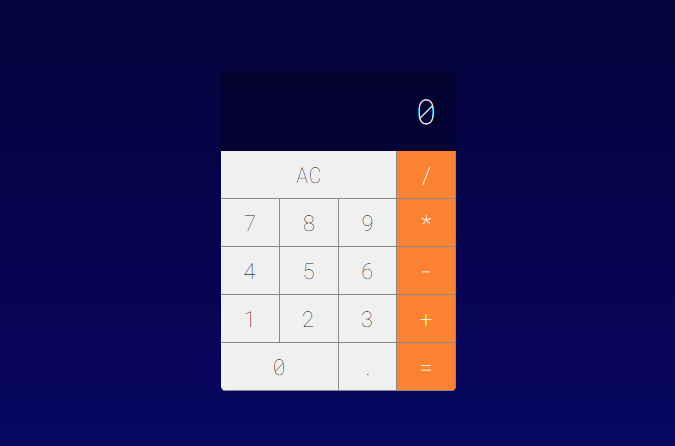

Calculadora

 

## 🔷 Netlify

### [Live Demo - Clique aqui!](https://jhonatanbergmann-simplecalculator.netlify.app/)

## 📅 Sobre

Simples Calculadora, Aplicação React.

  

## 🌐 Tecnologias Usadas
Foram usadas essa tecnologias:

- [React](https://pt-br.reactjs.org/)
- [Yarn](https://yarnpkg.com/)

## ***</>*** Como usar o código?
1. Instale o **Yarn** em seu computador
1. Instale o **NodeJs** na versão >= 12.0
1. Clone este repositório `git clone https://github.com/JhonatanBergmann/simple-calculator-app`

### 🌐 Web
1. Acesse o diretório e dê o comando `yarn install`
1. Acesse a pasta *web* e dê o comando `yarn start`
1. Acesse em seu navegador a seguinte url `http://localhost:3000`
